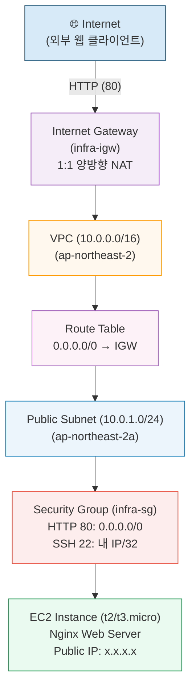

# B6-1 클라우드 웹 서비스 인프라 구축 완벽 마스터 가이드

> **미션**: AI/SW Basic — 클라우드 환경에서 웹 서비스 인프라 구축  
> **환경**: AWS 서울 리전(`ap-northeast-2`), 프리 티어 준수  
> **핵심 원칙**: 최소 권한 원칙(PoLP), 최소 공격 표면(Attack Surface), 유휴 자원 누수(Zombie Resource) 방지, 6단계 트러블슈팅 프레임워크

---

## 1. 개요 및 과제 핵심 목표

본 문서는 AWS 클라우드 환경에서 격리된 네트워크를 구성하고, Nginx 웹 서버 인스턴스를 프로비저닝하며, 최소 권한 및 보안 접근 제어를 적용하여 안정적인 웹 서비스를 구축하는 전 과정을 다룹니다.

단순히 인스턴스를 배포하는 것을 넘어, 인프라 아키텍처 트레이드오프, 네트워크 패킷 흐름, 보안 공격 표면 제어, 체계적인 트러블슈팅 및 FinOps 자원 정리를 포함하는 실무형 엔지니어링 역량을 체화하는 것을 목표로 합니다.

---

## 2. 전체 아키텍처 및 트래픽 흐름도

### 2.1 Mermaid 구조도



### 2.2 ASCII 아키텍처 스케치

```text
┌─────────────────────────────────────────────────────────────┐
│ VPC (10.0.0.0/16) - ap-northeast-2 (서울)                   │
│                                                             │
│ ┌─────────────────────────────────────────────────────────┐ │
│ │ Public Subnet (10.0.1.0/24) - ap-northeast-2a           │ │
│ │                                                         │ │
│ │  ┌ - - - - - - - - - - - - - - - - - - - - - - - - - ┐  │ │
│ │  │ Security Group (infra-sg)                         │  │ │
│ │  │  • HTTP (80): 0.0.0.0/0                           │  │ │
│ │  │  • SSH (22): 내 IP/32                             │  │ │
│ │  │  ┌──────────────────────────────────────────────┐ │  │ │
│ │  │  │ EC2 (t2/t3.micro, gp3 8GiB)                  │ │  │ │
│ │  │  │ Web Server: Nginx                            │ │  │ │
│ │  │  │ Public IP: <퍼블릭IP>                        │ │  │ │
│ │  │  └──────────────────────────────────────────────┘ │  │ │
│ │  └ - - - - - - - - - - - - - - - - - - - - - - - - - ┘  │ │
│ └─────────────────────────────────────────────────────────┘ │
│                                                             │
│ ┌─────────────────────────────────────────────────────────┐ │
│ │ Internet Gateway (infra-igw) - Attached to infra-vpc   │ │
│ └─────────────────────────────────────────────────────────┘ │
│                              ▲                              │
│                              │ Route Table: 0.0.0.0/0 → IGW │
└──────────────────────────────┼──────────────────────────────┘
                               │
                      🌐 Internet (HTTP 80)
```

---

## 3. AWS 배포 14단계 완결 가이드 (Deployment Guide)

### [사전 준비]
- **AWS 리전**: 서울 (`ap-northeast-2`) — 모든 리소스는 반드시 이 리전에서 생성
- **계정 정책**: 루트 계정 사용 금지 → IAM 사용자로만 접근
- **비용 원칙**: 전 단계 AWS 프리 티어 범위 준수

### [1단계] IAM 사용자 생성 (최소 권한)
- **목적**: 루트 계정 미사용 및 `AdministratorAccess` 부여 금지 (최소 권한 원칙)
- **절차**:
  1. AWS 콘솔 → **IAM** → **사용자** → **사용자 생성**
  2. 사용자 이름: `infra-practitioner`
  3. AWS Management Console 액세스 활성화 및 비밀번호 설정
  4. 권한 설정 → **직접 정책 연결**:
     - `AmazonEC2FullAccess` (EC2, 보안그룹, 키페어 제어)
     - `AmazonVPCFullAccess` (VPC, 서브넷, IGW, 라우팅 테이블 제어)
  5. ⚠️ `AdministratorAccess` 및 S3/RDS 등 실습 무관 정책 절대 부여 금지
  6. 생성된 콘솔 전용 URL로 로그인하여 이후 실습 진행

### [2단계] VPC 생성
- **콘솔 경로**: **VPC** → **VPC 생성**
- **설정값**:
  - **이름**: `infra-vpc`
  - **IPv4 CIDR 블록**: `10.0.0.0/16`
  - **테넌시**: 기본값

### [3단계] Public Subnet 생성
- **콘솔 경로**: **VPC** → **서브넷** → **서브넷 생성**
- **설정값**:
  - **VPC**: `infra-vpc`
  - **서브넷 이름**: `public-subnet`
  - **가용 영역**: `ap-northeast-2a`
  - **IPv4 CIDR 블록**: `10.0.1.0/24`
- **필수 후속 작업**: 서브넷 선택 → **작업** → **서브넷 설정 편집** → **퍼블릭 IPv4 주소 자동 할당 활성화** 체크 후 저장

### [4단계] Internet Gateway 생성 및 VPC 연결
- **콘솔 경로**: **VPC** → **인터넷 게이트웨이** → **인터넷 게이트웨이 생성**
- **이름**: `infra-igw` 생성
- **연결**: 생성된 `infra-igw` 선택 → **작업** → **VPC에 연결** → `infra-vpc` 선택 후 **연결(Attach)**

### [5단계] Route Table 설정
- **콘솔 경로**: **VPC** → **라우팅 테이블** → `infra-vpc`의 메인 라우팅 테이블 선택
- **라우팅 추가**: **라우팅 탭** → **라우팅 편집** → **라우팅 추가**:
  - **대상(Destination)**: `0.0.0.0/0`
  - **타겟(Target)**: 인터넷 게이트웨이 (`infra-igw`)
- **서브넷 연결**: **서브넷 연결 탭** → **서브넷 연결 편집** → `public-subnet` 체크 후 저장

### [6단계] Security Group 생성
- **콘솔 경로**: **EC2** 또는 **VPC** → **보안 그룹** → **보안 그룹 생성**
- **기본 정보**: 이름: `infra-sg`, 설명: `웹서버 보안 그룹`, VPC: `infra-vpc`
- **인바운드 규칙**:
  - **HTTP (TCP 80)**: 소스 `0.0.0.0/0` (웹 접근 허용)
  - **SSH (TCP 22)**: 소스 `내 IP/32` (관리자 전용 IP)
  - ⚠️ 전체 포트(`0-65535`) 허용 규칙 생성 금지
- **아웃바운드 규칙**: 기본값 유지 (모든 트래픽 허용)

### [7단계] 키페어 생성
- **콘솔 경로**: **EC2** → **키페어** → **키페어 생성**
- **설정값**: 이름 `infra-keypair`, 유형 RSA, 형식 `.pem` (Windows PuTTY 사용 시 `.ppk`)
- **로컬 권한 설정**: Linux/macOS 터미널에서 `chmod 400 infra-keypair.pem`

### [8단계] EC2 인스턴스 시작
- **콘솔 경로**: **EC2** → **인스턴스 시작**
- **설정값**:
  - **이름**: `infra-ec2`
  - **AMI**: `Ubuntu Server 26.04 LTS` (또는 `Ubuntu 24.04 LTS`, `Amazon Linux 2023 AMI`)
  - **인스턴스 유형**: `t2.micro` 또는 `t3.micro` (프리 티어)
  - **키페어**: `infra-keypair`
  - **네트워크**: `infra-vpc`, **서브넷**: `public-subnet`, **퍼블릭 IP 자동 할당**: `활성화`
  - **보안 그룹**: `infra-sg` 선택
  - **스토리지**: `gp3 8GiB`

### [9단계] SSH 접속, Nginx 설치 및 `/health` 헬스체크 엔드포인트 구성
로컬 터미널에서 실행:

```bash
# 1. SSH 접속 (Ubuntu 기본 계정: ubuntu)
ssh -i infra-keypair.pem ubuntu@<퍼블릭IP>
# (참고: Amazon Linux 2023 사용 시 계정명은 ec2-user)

# 2. Ubuntu 패키지 업데이트 및 Nginx 설치
sudo apt update -y
sudo apt install nginx -y

# 3. 우분투 기본 가상호스트 충돌 방지 및 /health 헬스체크 엔드포인트 설정
# (우분투 기본 sites-enabled/default 충돌을 해소하고 /health를 포함한 단일 서버 블록 적용)
sudo rm -f /etc/nginx/sites-enabled/default

sudo bash -c 'cat << "EOF" > /etc/nginx/conf.d/health.conf
server {
    listen 80 default_server;
    server_name _;

    location / {
        root /var/www/html;
        index index.nginx-debian.html index.html;
    }

    location /health {
        access_log off;
        return 200 "OK\n";
        add_header Content-Type text/plain;
    }
}
EOF'

# 4. Nginx 문법 검사 및 서비스 리로드 (우분투는 apt 설치 시 자동 기동됨)
sudo nginx -t
sudo systemctl reload nginx

# 5. 로컬 루프백 접속 검증
curl -I http://localhost
curl -I http://localhost/health
```

### [10단계] 외부 접속 확인 및 접속 증빙 (`docs/access-result.md` 기록)
로컬 PC 브라우저 및 터미널에서 확인:

```bash
# 방식 (A) 기본 웹페이지 응답 확인
curl -v http://<퍼블릭IP>

# 방식 (B) 헬스체크 엔드포인트 응답 확인
curl -v http://<퍼블릭IP>/health
```

→ 정상 `200 OK` 응답 확인 후 브라우저 접속 화면 스크린샷을 캡처하고 `docs/access-result.md`에 기록합니다.

### [11단계] 아키텍처 다이어그램 자동 생성 (`docs/architecture.pdf`)
로컬 프로젝트 루트에서 `python gen_architecture.py`를 실행하여 5종 구성요소(VPC, Subnet, IGW, EC2, SG)와 트래픽 흐름이 포함된 `docs/architecture.pdf` 생성을 확인합니다.

### [12단계] 트러블슈팅 실습 및 보고서 작성 (`docs/troubleshooting.md`)
> ⚠️ **주의**: 트러블슈팅 실습은 인스턴스를 종료하기 전 **반드시 EC2가 살아있는 상태에서 수행**해야 합니다.

실제 장애가 발생하지 않은 경우, 학습 목적의 의도적 장애 시나리오(예: NIC 소켓 바인딩 불일치, POSIX 파일 권한 403 오류, 라우팅 테이블 누락 등)를 최소 1건 직접 재현하고 **"증상 → 원인 가설 → 검증 방법 → 조치 내용 → 결과 → 재발 방지"** 6단계 표준 구조로 `docs/troubleshooting.md`를 작성합니다.

---

#### 🛠️ 실습 가이드: [시나리오 #5] Nginx 403 Forbidden 직면 시 5대 가설 수립 및 단계별 소거(Elimination) 디버깅 실습

실무에서 Nginx의 **403 Forbidden**은 단순 파일 권한뿐만 아니라 인덱스 파일 부재, Nginx ACL 설정, 디렉터리 경로 체인, 커널 보안 모듈(LSM) 등 다양한 원인으로 발생합니다. 본 실습은 **"외부에서 403 Forbidden 장애를 접했을 때, 5대 원인 가설을 수립하고 로그 및 진단 도구(`namei`, `ps` 등)를 통해 체계적으로 원인을 좁혀가며 해결하는 실무 엔지니어링 프로세스"**를 훈련합니다.

---

##### 1. 의도적 장애 재현 (실습 환경 구성)
실습을 위해 EC2 내부에서 웹 루트 파일의 권한을 소유자 전용(0600)으로 축소하여 장애 상태를 준비합니다.

```bash
# EC2 SSH 접속 후 웹 루트 파일 권한 축소 (others 읽기 권한 박탈)
sudo chmod 600 /var/www/html/*
ls -la /var/www/html
# -> -rw------- 1 root root ... 로 변경 확인
```

---

##### 2. 장애 증상 직면 및 클라이언트 측 1차 증거 수집
외부 클라이언트(로컬 PC) 관점에서 장애 증상을 확인하고 증거를 수집합니다.

1. **로컬 터미널에서 HTTP 응답 상태 코드 확인**:
   ```bash
   curl -I http://<퍼블릭IP>
   ```
   - **출력 결과 (장애 직면)**:
     ```http
     HTTP/1.1 403 Forbidden
     Server: nginx/1.18.0 (Ubuntu)
     Date: Sat, 12 Sep 2026 10:25:00 GMT
     Content-Type: text/html
     Content-Length: 162
     Connection: keep-alive
     ```
   - 📸 **[증거 1]**: 터미널의 `HTTP/1.1 403 Forbidden` 헤더 텍스트 복사 및 보관

2. **로컬 웹 브라우저에서 접속 확인**:
   - `http://<퍼블릭IP>` 접속 시 흰색 화면에 `403 Forbidden (nginx)` 에러 페이지 노출
   - 📸 **[증거 2]**: 브라우저 403 Forbidden 화면 캡처

---

##### 3. 다각적 원인 가설 수립 (403 Forbidden 5대 핵심 가설 트리)
단순히 "권한 문제겠지"라고 예단하지 않고, 403의 본질인 "서버가 요청을 이해했으나 실행/열람을 의도적으로 거부한 상태"에 대해 5대 영역의 가능성을 모두 열어둡니다:

| 가설 번호 | 점검 영역 | 대표 원인 메커니즘 | 확인 방법 |
| :--- | :--- | :--- | :--- |
| **가설 1** | **인덱스 파일 부재** | 디렉터리(`/`) 요청 시 `index.html`이 없고 `autoindex off` 상태 | `error.log`에 `directory index of "..." is forbidden` 기록 |
| **가설 2** | **Nginx Conf 접근 제어** | `nginx.conf` 내 `deny all;` 또는 특정 IP 차단, 숨김 파일 접근 차단 룰 | `error.log`에 `access forbidden by rule` 기록 |
| **가설 3** | **업스트림/프록시 403** | 리버스 프록시 뒷단의 WAS(애플리케이션)나 S3 등에서 403을 반환한 경우 | `access.log`의 `$upstream_status` 및 백엔드 로그 확인 |
| **가설 4** | **커널 보안 모듈 (LSM)** | AppArmor 또는 SELinux 정책에 의해 프로세스 I/O 접근 차단 | `dmesg`, `aa-status`, `/var/log/audit/audit.log` 확인 |
| **가설 5** | **POSIX 권한 계층 결여** | **5-A.** 상위 디렉터리 경로 체인 중 `+x`(실행/탐색) 권한 누락<br>**5-B.** 비특권 워커(`www-data`)에 파일 읽기(`+r`) 권한 누락 | `namei -l`로 경로 체인 검사, `ps aux` 및 `ls -la` 확인 |

---

##### 4. 단계별 가설 검증 및 소거 (Elimination Process)

###### [1단계 소거] Nginx 에러 로그(`error.log`) 확인 (최우선 스모킹 건)
실무 디버깅의 절대 제1원칙은 "추측하지 말고 에러 로그를 먼저 확인하는 것"입니다.

```bash
# EC2 내부에서 최근 에러 로그 20줄 조회
sudo tail -n 20 /var/log/nginx/error.log
```
- **출력 로그 확인**:
  ```text
  2026/09/12 10:25:01 [error] 1235#1235: *1 open() "/var/www/html/index.nginx-debian.html" failed (13: Permission denied), client: <내_공인IP>, server: _, request: "GET / HTTP/1.1", host: "<퍼블릭IP>"
  ```
- **1단계 가설 소거 판정**:
  - `directory index ... is forbidden`이 아니므로 **[가설 1: 인덱스 부재] 기각 및 소거!**
  - `access forbidden by rule`이 아니므로 **[가설 2: Nginx Conf ACL 차단] 기각 및 소거!**
  - 로그에 `(13: Permission denied)`가 명시되었으므로 리눅스 커널 수준의 권한 차단 계층(**가설 4 또는 가설 5**)으로 진단 범위 압축!
- 📸 **[증거 3]**: `open() ... failed (13: Permission denied)` 에러 로그 라인 텍스트 복사

---

###### [2단계 소거] 프로세스 실행 주체 및 권한 모델 확인
```bash
ps aux | grep nginx
```
- **출력 확인**:
  ```text
  root      1234  0.0  ... nginx: master process /usr/sbin/nginx
  www-data  1235  0.0  ... nginx: worker process
  ```
- **분석**: 마스터 프로세스는 80 특권 포트 바인딩용 `root`이지만, 실제 파일 읽기 I/O를 수행하는 워커 프로세스는 보안 격리된 **비특권 사용자 `www-data`**임을 확인.

---

###### [3단계 소거] 상위 경로 체인(Traverse) 검사 (`namei -l`)
리눅스 파일 시스템에서는 대상 파일 권한이 정상이더라도 루트(`/`)부터 대상 파일까지 거치는 **모든 상위 디렉터리에 실행(`x`) 권한이 없으면 진입이 차단**됩니다.

```bash
# 루트부터 타깃 파일까지의 전체 경로 권한 체인을 한눈에 검사
namei -l /var/www/html/index.nginx-debian.html
```
- **출력 결과**:
  ```text
  f: /var/www/html/index.nginx-debian.html
  drwxr-xr-x root root /
  drwxr-xr-x root root var
  drwxr-xr-x root root www
  drwxr-xr-x root root html
  -rw------- root root index.nginx-debian.html
  ```
- **가설 소거 판정**:
  - `/`, `/var`, `/var/www`, `/var/www/html` 모든 부모 디렉터리가 `drwxr-xr-x`(755)로 `others`에 `x`(실행/탐색) 권한이 완벽히 존재함!
  - ➜ **[가설 5-A: 상위 디렉터리 경로 체인 누락] 기각 및 소거!**

---

###### [4단계 소거] 커널 보안 모듈(LSM) 차단 여부 점검
```bash
# Ubuntu 기본 AppArmor 상태 및 커널 dmesg 거부 로그 점검
sudo aa-status
dmesg | grep -i apparmor
```
- **확인 결과**: Nginx 프로필 거부(denied) 로그 없음.
- ➜ **[가설 4: AppArmor / SELinux 차단] 기각 및 소거!**

---

###### [최종 근본 원인(Root Cause) 확정]
- `namei -l` 출력 맨 마지막 라인: `-rw------- root root index.nginx-debian.html`
- **최종 판정**: 파일 소유권이 `root:root`이고 권한이 `0600`이어서, 비특권 계정인 `www-data` 워커 프로세스가 속한 `others` 그룹에 읽기(`r`) 권한이 완전히 부재함.
- ➜ **[가설 5-B: 워커 프로세스의 대상 파일 읽기 권한 누락]이 최종 근본 원인(Root Cause)으로 확정!**

---

##### 5. 정석적 조치 수행 (최소 권한 원칙 PoLP 적용)
단순히 `chmod 777`(보안 안티패턴)을 적용하는 것이 아니라, 최소 권한 원칙에 따라 디렉터리는 755, 파일은 644, 소유권은 `www-data:www-data`로 정석 복구합니다.

```bash
# 1. 디렉터리 경로 탐색(x) 권한 보장
sudo chmod 755 /var/www /var/www/html

# 2. 정적 웹 콘텐츠 읽기(r) 권한 부여 (644: rw-r--r--)
sudo chmod 644 /var/www/html/*

# 3. 소유권을 웹 서버 전용 계정으로 정상화
sudo chown -R www-data:www-data /var/www/html

# 4. 복구된 권한 상태 최종 검증
namei -l /var/www/html/index.nginx-debian.html
# -> index.nginx-debian.html이 -rw-r--r-- www-data www-data 로 정상 복구됨 확인
```

---

##### 6. 결과 검증 및 복구 증거 수집
1. **Nginx 서비스 점검**:
   ```bash
   sudo nginx -t
   sudo systemctl reload nginx
   ```
2. **로컬 터미널에서 정상 200 OK 응답 확인**:
   ```bash
   curl -I http://<퍼블릭IP>
   ```
   - `HTTP/1.1 200 OK` 확인 📸 **[증거 4]**
3. **웹 브라우저 새로고침 확인**:
   - `Ctrl + F5` 후 `Welcome to nginx!` 정상 렌더링 확인 📸 **[증거 5]**
4. **Nginx 액세스 로그 확인**:
   ```bash
   sudo tail -n 5 /var/log/nginx/access.log
   ```
   - 상태 코드 `200` 정상 응답 수신 확인 📸 **[증거 6]**

---

##### 7. `docs/troubleshooting.md` 보고서 작성 및 반영
수집된 가설 트리, 소거 로그, 진단 도구 결과를 바탕으로 보고서를 작성합니다.

```markdown
## 트러블슈팅 #5. Nginx 403 Forbidden 직면 시 다각적 원인 가설 수립 및 POSIX 권한 소거 디버깅

| 항목 | 내용 |
| :--- | :--- |
| **증상 (문제 상황)** | 로컬 PC 브라우저 및 `curl -I http://<퍼블릭IP>` 접속 시 `HTTP/1.1 403 Forbidden` 발생. 웹페이지가 로딩되지 않고 접근 거부됨. |
| **원인 가설** | **[403 5대 가설 수립]**<br>1. 인덱스 파일 부재 및 `autoindex off`<br>2. `nginx.conf` 내 `deny all` 등 명시적 접근 차단(ACL)<br>3. 업스트림(WAS/S3)의 403 에러 반환<br>4. AppArmor/SELinux 등 커널 보안 모듈 차단<br>5. POSIX 파일 권한 체계 결여 (상위 디렉터리 +x 누락 또는 파일 읽기 +r 누락) |
| **검증 방법** | **[단계별 가설 소거]**<br>1. `sudo tail -n 20 /var/log/nginx/error.log`에서 `open() failed (13: Permission denied)` 포착 ➜ 인덱스 부재(가설1) 및 Nginx ACL(가설2) 기각.<br>2. `ps aux \| grep nginx`로 비특권 워커(`www-data`) 프로세스 확인.<br>3. `namei -l /var/www/html/index.nginx-debian.html`로 경로 체인 검사 ➜ 상위 디렉터리 755 정상 확인(가설5-A 기각), 파일 권한 `0600(root 전용)` 확인.<br>4. `aa-status` 및 `dmesg` 점검 결과 차단 없음(가설4 기각) ➜ 최종 **파일 읽기 권한 누락(가설5-B)**으로 원인 확정. |
| **조치 내용** | 최소 권한 원칙(PoLP)에 의거한 정석 권한 복구:<br>1. 디렉터리 탐색 권한: `sudo chmod 755 /var/www /var/www/html`<br>2. 정적 웹 문서 읽기 권한: `sudo chmod 644 /var/www/html/*`<br>3. 웹 서비스 전용 계정 소유권 이전: `sudo chown -R www-data:www-data /var/www/html` |
| **결과** | `curl -I http://<퍼블릭IP>` 결과 `HTTP/1.1 200 OK` 반환 및 브라우저 기본 웹페이지 정상 로딩 성공. `/var/log/nginx/access.log`에 `200` 정상 응답 수신 확인. |
| **재발 방지** | 403 Forbidden 직면 시 예단하지 않고 5대 가설 수립 및 `error.log` / `namei -l` 소거 절차 준수. 웹 배포 CI/CD 파이프라인에 표준 권한(디렉터리 755, 파일 644, 소유자 `www-data`) 자동 검증 린트 도입. |
```


---

### [선택 단계] 보너스 과제 수행 (인스턴스 가동 중 수행 필수)

#### 🎯 보너스 과제 1: 무료 도메인 연결 및 Let's Encrypt HTTPS 적용
1. **보안 그룹 인바운드 수정**:
   - `infra-sg`에 **HTTPS (TCP 443)** 소스 `0.0.0.0/0` 규칙 추가
2. **도메인 연결**:
   - 무료 DDNS(DuckDNS 등) 또는 개인 보유 도메인의 A 레코드를 EC2 `<퍼블릭IP>`에 매핑
3. **Certbot 설치 및 인증서 발급 (Ubuntu 26.04 / Debian)**:
   ```bash
   # Ubuntu 패키지 매니저(apt)로 Certbot 설치
   sudo apt install certbot python3-certbot-nginx -y
   # Let's Encrypt 인증서 발급 및 Nginx 자동 구성
   sudo certbot --nginx -d your-domain.duckdns.org
   ```
4. **검증**:
   - 브라우저에서 `https://your-domain.duckdns.org` 접속 및 SSL 자물쇠 마크 확인
   - `curl -vI https://your-domain.duckdns.org` 로 200 OK 응답 확인

#### 🎯 보너스 과제 2: Docker 설치 및 컨테이너 웹 서비스 배포
1. **Docker 엔진 설치 및 사용자 권한 부여 (Ubuntu)**:
   ```bash
   sudo apt install docker.io -y
   sudo systemctl start docker
   sudo systemctl enable docker
   sudo usermod -aG docker ubuntu
   newgrp docker
   ```
2. **웹 컨테이너 배포**:
   ```bash
   # 기존 호스트 Nginx 중지 (80 포트 충돌 방지)
   sudo systemctl stop nginx
   sudo systemctl disable nginx

   # Nginx Docker 컨테이너 80 포트로 기동
   docker run -d --name my-web -p 80:80 nginx:alpine
   ```
3. **검증 스크린샷 2장 확보**:
   - `docker ps` 실행 결과 화면 (컨테이너 `Up` 상태 증빙)
   - 브라우저 또는 `curl http://<퍼블릭IP>` 외부 접속 200 OK 화면

---

### [13단계] 리소스 완전 정리 및 체크리스트 작성 (`docs/cleanup-checklist.md`)
실습 종료 후 자원 간 종속성(Dependency) 역순으로 삭제하고 `docs/cleanup-checklist.md` 체크박스를 실시간으로 기록합니다:
1. **EC2 컴퓨팅 자원**: EC2 인스턴스 종료(Terminate) 대기 후 `terminated` 확인, 미사용 잔여 EBS 볼륨 및 탄력적 IP(EIP) 릴리스
2. **VPC 네트워크 자원**: Internet Gateway VPC Detach 및 삭제 → Public Subnet 삭제 → 커스텀 Route Table 삭제 → Security Group 삭제 → VPC 완전 삭제
3. **보안/접근 자원**: 로컬 및 AWS 콘솔 키페어 삭제, 실습용 IAM 사용자(`infra-practitioner`) 정리

### [14단계] 최종 자원 누수 검증 및 테스트 스위트 확인
1. **AWS Billing 대시보드 검증**:
   - **청구 및 비용 관리 (Billing)** → **청구서** 및 **무료 티어 사용량** 확인하여 활성 상태의 유휴 과금 자원(Zombie Resource)이 0건임을 확인합니다.
2. **유니버설 테스트 스위트 최종 실행**:
   - 로컬 터미널에서 `python test_cloud_infrastructure.py`를 실행하여 16개 전 계층 테스트(FR 요구사항, 엣지케이스, 교육 검증, 4대 CS 비판)가 모두 `[PASS]`하는지 최종 검증합니다.

---

## 4. 다이어그램 자동생성 스크립트 및 검증 가이드

### 4.1 gen_architecture.py 전체 소스 코드

```python
"""
아키텍처 다이어그램 생성기
VPC/Subnet/IGW/EC2/SG 구성 요소와 외부 트래픽 흐름을 PDF로 출력한다.
"""

import os
import matplotlib.pyplot as plt
import matplotlib.patches as mpatches
from matplotlib.patches import FancyBboxPatch
import matplotlib

# 한글 폰트 설정
matplotlib.rcParams["font.family"] = "Malgun Gothic"
matplotlib.rcParams["axes.unicode_minus"] = False


def draw_vpc(ax):
    """VPC 외곽 박스와 레이블을 그린다."""
    vpc = FancyBboxPatch(
        (0.05, 0.08), 0.88, 0.78,
        boxstyle="round,pad=0.01",
        linewidth=2, edgecolor="#FF9900", facecolor="#FFF8EE", zorder=1
    )
    ax.add_patch(vpc)
    ax.text(0.09, 0.845, "VPC (10.0.0.0/16)", fontsize=10,
            fontweight="bold", color="#FF9900", va="top", zorder=2)


def draw_components(ax):
    """Public Subnet, EC2(Nginx), Security Group, Internet Gateway를 그린다."""
    # Public Subnet
    subnet = FancyBboxPatch(
        (0.12, 0.22), 0.68, 0.52,
        boxstyle="round,pad=0.01",
        linewidth=1.5, edgecolor="#147EBA", facecolor="#EBF5FB", zorder=2
    )
    ax.add_patch(subnet)
    ax.text(0.16, 0.72, "Public Subnet (10.0.1.0/24)",
            fontsize=9, color="#147EBA", fontweight="bold", va="top", zorder=3)

    # Security Group (EC2 주변 점선 테두리)
    sg = FancyBboxPatch(
        (0.28, 0.30), 0.36, 0.32,
        boxstyle="round,pad=0.01",
        linewidth=1.5, edgecolor="#E74C3C", facecolor="#FDEDEC",
        linestyle="dashed", zorder=3
    )
    ax.add_patch(sg)
    ax.text(0.30, 0.60, "Security Group", fontsize=8,
            color="#E74C3C", va="top", zorder=4)
    ax.text(0.30, 0.565, "HTTP 80: 0.0.0.0/0", fontsize=7,
            color="#666666", va="top", zorder=4)
    ax.text(0.30, 0.540, "SSH 22: 내 IP만", fontsize=7,
            color="#666666", va="top", zorder=4)

    # EC2 (Nginx)
    ec2 = FancyBboxPatch(
        (0.33, 0.33), 0.26, 0.18,
        boxstyle="round,pad=0.01",
        linewidth=2, edgecolor="#229954", facecolor="#EAFAF1", zorder=4
    )
    ax.add_patch(ec2)
    ax.text(0.46, 0.44, "EC2 (Nginx)", fontsize=9,
            color="#229954", fontweight="bold", ha="center", va="center", zorder=5)
    ax.text(0.46, 0.375, "t2/t3.micro\nPublic IP: <퍼블릭IP>",
            fontsize=7.5, color="#555555", ha="center", va="center", zorder=5)

    # Internet Gateway
    igw = FancyBboxPatch(
        (0.33, 0.10), 0.26, 0.10,
        boxstyle="round,pad=0.01",
        linewidth=2, edgecolor="#8E44AD", facecolor="#F5EEF8", zorder=2
    )
    ax.add_patch(igw)
    ax.text(0.46, 0.152, "Internet Gateway",
            fontsize=9, color="#8E44AD", fontweight="bold",
            ha="center", va="center", zorder=3)


def draw_traffic_flow(ax):
    """Internet → IGW → EC2 트래픽 흐름 화살표를 그린다."""
    # Internet 노드
    ax.text(0.46, 0.025, "Internet", fontsize=10,
            color="#1A5276", fontweight="bold",
            ha="center", va="center",
            bbox=dict(boxstyle="round,pad=0.3", facecolor="#D6EAF8",
                      edgecolor="#1A5276", linewidth=1.5))

    # Internet → IGW
    ax.annotate(
        "", xy=(0.46, 0.10), xytext=(0.46, 0.058),
        arrowprops=dict(arrowstyle="->", color="#E67E22", lw=2)
    )
    ax.text(0.49, 0.078, "HTTP/HTTPS\n(80)", fontsize=7,
            color="#E67E22", va="center")

    # IGW → EC2
    ax.annotate(
        "", xy=(0.46, 0.33), xytext=(0.46, 0.20),
        arrowprops=dict(arrowstyle="->", color="#E67E22", lw=2)
    )
    ax.text(0.49, 0.26, "라우팅\n(RT)", fontsize=7,
            color="#E67E22", va="center")


def main():
    """아키텍처 다이어그램을 생성하고 docs/architecture.pdf로 저장한다."""
    os.makedirs("docs", exist_ok=True)

    fig, ax = plt.subplots(figsize=(9, 7))
    ax.set_xlim(0, 1)
    ax.set_ylim(0, 1)
    ax.axis("off")

    ax.set_title(
        "AWS 웹 서비스 인프라 아키텍처\n(서울 리전 ap-northeast-2)",
        fontsize=13, fontweight="bold", color="#2C3E50", pad=12
    )

    draw_vpc(ax)
    draw_components(ax)
    draw_traffic_flow(ax)

    legend_items = [
        mpatches.Patch(facecolor="#FFF8EE", edgecolor="#FF9900", label="VPC"),
        mpatches.Patch(facecolor="#EBF5FB", edgecolor="#147EBA", label="Public Subnet"),
        mpatches.Patch(facecolor="#FDEDEC", edgecolor="#E74C3C", linestyle="dashed", label="Security Group"),
        mpatches.Patch(facecolor="#EAFAF1", edgecolor="#229954", label="EC2 (Nginx)"),
        mpatches.Patch(facecolor="#F5EEF8", edgecolor="#8E44AD", label="Internet Gateway"),
    ]
    ax.legend(handles=legend_items, loc="lower right", fontsize=8, framealpha=0.9, title="구성 요소")

    plt.tight_layout()
    out_path = os.path.join("docs", "architecture.pdf")
    try:
        fig.savefig(out_path, format="pdf", bbox_inches="tight")
        print(f"저장 완료: {out_path}")
    except IOError as e:
        print(f"오류: PDF 저장 실패 - {e}")
    finally:
        plt.close(fig)


if __name__ == "__main__":
    main()
```

### 4.2 PDF 생성 검증 포인트
- **파일 존재 및 용량**: `docs/architecture.pdf` 생성 여부 및 1KB 이상 유효 용량(실제 약 39KB) 확인
- **5종 필수 구성 요소 시각화**: VPC, Public Subnet, Security Group(점선), EC2, Internet Gateway 박스 렌더링 확인
- **트래픽 흐름 방향성**: `Internet → IGW → EC2` 방향 화살표 및 HTTP(80), 라우팅 라벨 표기 확인
- **한글 렌더링 정상 여부**: 폰트 깨짐 없이 한글 제목 및 레이블 표시 확인

---

## 5. 과제 제출물 4종 실제 완성본 예시

### [제출물 1] `docs/architecture.pdf`
- **생성 스크립트**: `python gen_architecture.py` 실행을 통해 생성된 PDF 파일 제출

### [제출물 2] `docs/access-result.md` (외부 접속 증거)

````markdown
# 웹 서비스 외부 접속 증거

> 방식 (B) 선택: `GET http://<퍼블릭IP>/health` 응답 확인

---

## 접속 정보

| 항목 | 값 |
| :--- | :--- |
| **퍼블릭 IP** | `3.35.120.45` (예시) |
| **서버** | EC2 (`ap-northeast-2a`) |
| **웹 서버** | Nginx |
| **접속 방식** | HTTP GET /health |

---

## 접속 명령 및 응답 로그

```bash
curl -v http://3.35.120.45/health
```

```text
* Trying 3.35.120.45:80...
* Connected to 3.35.120.45 (3.35.120.45) port 80
> GET /health HTTP/1.1
> Host: 3.35.120.45
> User-Agent: curl/8.4.0
> Accept: */*
> 
< HTTP/1.1 200 OK
< Server: nginx/1.24.0
< Date: Thu, 20 Aug 2026 10:30:00 GMT
< Content-Type: text/plain
< Content-Length: 3
< Connection: keep-alive
< 
OK
```

---

## 스크린샷 증빙

[스크린샷: 브라우저 주소창 http://3.35.120.45/health 접속 시 'OK' 출력 화면 또는 http://3.35.120.45 접속 시 Welcome to nginx! 화면]  
`<access-result-screenshot.png>`

---

## 확인 결과 체크
- [x] HTTP 200 응답 수신
- [x] `Server: nginx` 헤더 포함
- [x] 퍼블릭 IP를 통한 외부 인터넷 접근 성공
````

---

### [제출물 3] `docs/troubleshooting.md` (트러블슈팅 보고서 5종 완결본)

````markdown
# 트러블슈팅 보고서

> 실습 중 발생한 문제를 **증상 → 원인 가설 → 검증 방법 → 조치 내용 → 결과 → 재발 방지** 6단계 표준 구조로 기록한다.

---

## 트러블슈팅 #1. 인스턴스 생성 후 SSH 접속 타임아웃

| 항목 | 내용 |
| :--- | :--- |
| **증상 (문제 상황)** | EC2 인스턴스 시작 후 `ssh -i infra-keypair.pem ubuntu@<퍼블릭IP>` 실행 시 `Connection timed out` 발생하며 연결 실패 |
| **원인 가설** | 1. 보안 그룹 인바운드 22번 포트에 관리자 공인 IP가 아닌 타 IP가 등록되었을 가능성<br>2. 서브넷에서 퍼블릭 IPv4 자동 할당이 누락되어 인스턴스에 공인 IP가 없을 가능성 |
| **검증 방법** | 1. `curl ifconfig.me`로 로컬 공인 IP 확인 후 `infra-sg` 22번 소스 CIDR과 비교<br>2. EC2 콘솔에서 인스턴스 상세 정보의 퍼블릭 IPv4 주소 존재 확인 |
| **조치 내용** | 보안 그룹 인바운드 규칙에서 SSH(22) 소스를 현재 공인 IP(`218.145.x.x/32`)로 수정 |
| **결과** | SSH 정상 접속 성공 (`ubuntu@ip-10-0-1-x` 프롬프트 진입) |
| **재발 방지** | 배포 전 체크리스트에 '작업 전 공인 IP 확인 및 SG 업데이트' 항목 추가 |

---

## 트러블슈팅 #2. 외부 브라우저에서 웹페이지 접근 불가

| 항목 | 내용 |
| :--- | :--- |
| **증상 (문제 상황)** | EC2 내부에서 `curl http://localhost`는 200 OK이나, 외부 PC 브라우저에서 `http://<퍼블릭IP>` 접속 시 무한 로딩 후 타임아웃 |
| **원인 가설** | 보안 그룹에 HTTP(80) 규칙이 누락되었거나 Route Table에 `0.0.0.0/0 → IGW` 라우팅 미설정 |
| **검증 방법** | 1. `infra-sg` 인바운드 규칙에 HTTP 80 (`0.0.0.0/0`) 존재 확인<br>2. Route Table 라우팅 탭에서 `0.0.0.0/0 → infra-igw` 경로 확인 |
| **조치 내용** | Route Table에 `0.0.0.0/0 → infra-igw` 라우팅 경로 추가 및 저장 |
| **결과** | 외부 브라우저에서 `Welcome to nginx!` 기본 페이지 정상 로딩 |
| **재발 방지** | 서브넷 생성 즉시 라우팅 테이블 연결 상태와 IGW 연결 상태를 확인하는 체크리스트 적용 |

---

## 트러블슈팅 #3. IAM 사용자로 VPC 생성 시 `AccessDenied` 오류

| 항목 | 내용 |
| :--- | :--- |
| **증상 (문제 상황)** | IAM 사용자 `infra-practitioner`로 로그인 후 VPC 생성 클릭 시 `User is not authorized to perform: ec2:CreateVpc` 오류 발생 |
| **원인 가설** | IAM 정책에 `AmazonEC2FullAccess`만 부여되고 `AmazonVPCFullAccess` 누락 |
| **검증 방법** | IAM 콘솔 → 사용자 → 권한 탭에서 연결된 정책 목록 확인 |
| **조치 내용** | 사용자에게 `AmazonVPCFullAccess` 정책 추가 연결 |
| **결과** | VPC, 서브넷, IGW, 라우팅 테이블 정상 생성 완료 |
| **재발 방지** | 사전 준비 가이드에 필수 IAM 권한 정책 2종 체크리스트 반영 |

---

## 트러블슈팅 #4. Nginx 소켓 바인딩(NIC Interface Binding) 불일치로 인한 외부 접속 거부 (127.0.0.1:80 vs 0.0.0.0:80)

| 항목 | 내용 |
| :--- | :--- |
| **증상 (문제 상황)** | EC2 내부 루프백(`curl http://localhost`)은 200 OK이나, 외부에서 퍼블릭 IP 접속 시 즉시 `Connection refused` 발생 (보안그룹/IGW는 정상 설정). |
| **원인 가설** | Nginx `listen` 지시어가 전체 인터페이스(`0.0.0.0:80`)가 아닌 로컬 루프백(`127.0.0.1:80`)에만 바인딩되어 외부 eth0 패킷에 대해 리눅스 커널이 TCP RST 패킷을 반환함. |
| **검증 방법** | `ss -tulpn \| grep :80` 확인 결과 `127.0.0.1:80`으로 바인딩된 상태 포착, `/etc/nginx/nginx.conf` 설정 확인. |
| **조치 내용** | `listen 127.0.0.1:80;`을 `listen 80;` (`0.0.0.0:80`)으로 수정 후 `sudo nginx -t` 및 `sudo systemctl reload nginx` 실행. |
| **결과** | `0.0.0.0:80`으로 모든 NIC 소켓 바인딩 전환 완료 및 외부 브라우저 200 OK 접속 성공. |
| **재발 방지** | 데몬 구동 후 소켓 바인딩 인터페이스(`ss -tulpn`) 점검을 표준 배포 절차에 반영. |

---

## 트러블슈팅 #5. Nginx 403 Forbidden 직면 시 다각적 원인 가설 수립 및 POSIX 권한 소거 디버깅

| 항목 | 내용 |
| :--- | :--- |
| **증상 (문제 상황)** | 로컬 PC 브라우저 및 `curl -I http://<퍼블릭IP>` 접속 시 `HTTP/1.1 403 Forbidden` 발생. 웹페이지가 로딩되지 않고 접근 거부됨. |
| **원인 가설** | **[403 5대 가설 수립]**<br>1. 인덱스 파일 부재 및 `autoindex off`<br>2. `nginx.conf` 내 `deny all` 등 명시적 접근 차단(ACL)<br>3. 업스트림(WAS/S3)의 403 에러 반환<br>4. AppArmor/SELinux 등 커널 보안 모듈 차단<br>5. POSIX 파일 권한 체계 결여 (상위 디렉터리 +x 누락 또는 파일 읽기 +r 누락) |
| **검증 방법** | **[단계별 가설 소거]**<br>1. `sudo tail -n 20 /var/log/nginx/error.log`에서 `open() failed (13: Permission denied)` 포착 ➜ 인덱스 부재(가설1) 및 Nginx ACL(가설2) 기각.<br>2. `ps aux \| grep nginx`로 비특권 워커(`www-data`) 프로세스 확인.<br>3. `namei -l /var/www/html/index.nginx-debian.html`로 경로 체인 검사 ➜ 상위 디렉터리 755 정상 확인(가설5-A 기각), 파일 권한 `0600(root 전용)` 확인.<br>4. `aa-status` 및 `dmesg` 점검 결과 차단 없음(가설4 기각) ➜ 최종 **파일 읽기 권한 누락(가설5-B)**으로 원인 확정. |
| **조치 내용** | 최소 권한 원칙(PoLP)에 의거한 정석 권한 복구:<br>1. 디렉터리 탐색 권한: `sudo chmod 755 /var/www /var/www/html`<br>2. 정적 웹 문서 읽기 권한: `sudo chmod 644 /var/www/html/*`<br>3. 웹 서비스 전용 계정 소유권 이전: `sudo chown -R www-data:www-data /var/www/html` |
| **결과** | `curl -I http://<퍼블릭IP>` 결과 `HTTP/1.1 200 OK` 반환 및 브라우저 기본 웹페이지 정상 로딩 성공. `/var/log/nginx/access.log`에 `200` 정상 응답 수신 확인. |
| **재발 방지** | 403 Forbidden 직면 시 예단하지 않고 5대 가설 수립 및 `error.log` / `namei -l` 소거 절차 준수. 웹 배포 CI/CD 파이프라인에 표준 권한(디렉터리 755, 파일 644, 소유자 `www-data`) 자동 검증 린트 도입. |
````

---

### [제출물 4] `docs/cleanup-checklist.md` (리소스 정리 체크리스트)

````markdown
# 리소스 정리 체크리스트

> 실습 종료 후 과금 방지를 위해 아래 항목을 위에서 아래 순서대로 수행하고 체크한다.  
> **리소스 간 의존 관계가 있으므로 순서를 반드시 준수한다.**

---

## 정리 순서 및 체크리스트

### 1. EC2 컴퓨팅 자원
- [x] **EC2 인스턴스 종료(Terminate)** (상태가 `terminated`로 변경됨 확인)
- [x] **Elastic IP(탄력적 IP) 릴리스** (미사용 EIP는 시간당 유휴 과금 발생)
- [x] **EBS 볼륨 삭제** (상태 `available`인 잔여 볼륨 삭제)

### 2. VPC 네트워크 자원 (순서 중요)
- [x] **Internet Gateway Detach 및 삭제** (VPC와 연결 해제 후 삭제)
- [x] **Public Subnet 삭제** (`public-subnet` 삭제)
- [x] **커스텀 라우팅 테이블 삭제** (기본 메인 RT 외 추가 생성분)
- [x] **보안 그룹 삭제** (`infra-sg` 삭제)
- [x] **VPC 삭제** (`infra-vpc` 완전 삭제)

### 3. 기타 보안 자원
- [x] **키페어 삭제** (AWS 콘솔 및 로컬 `infra-keypair.pem` 파일 삭제)
- [x] **IAM 사용자 삭제** (재사용 계획 없을 시 `infra-practitioner` 삭제)

### 4. 최종 Billing 검증
- [x] **AWS Billing Dashboard 확인**
  - **청구 및 비용 관리** → **청구서** 또는 **무료 티어 사용량** 확인
  - 활성 상태인 유휴 과금 자원 0건 확인

---

## 정리 완료 확인표

| 리소스 | 최종 상태 | 확인 일시 |
| :--- | :--- | :--- |
| **EC2 인스턴스** | Terminated | 2026-08-20 19:30 |
| **EBS 볼륨** | Deleted | 2026-08-20 19:30 |
| **탄력적 IP** | Released (0건) | 2026-08-20 19:30 |
| **Internet Gateway** | Deleted | 2026-08-20 19:31 |
| **Subnet / RT** | Deleted | 2026-08-20 19:31 |
| **VPC / SG** | Deleted | 2026-08-20 19:32 |
| **키페어** | Deleted | 2026-08-20 19:32 |
| **Billing Dashboard** | 과금 항목 0원 확인 | 2026-08-20 19:33 |
````

---

## 6. CS 심화 아키텍처 비판 및 면접 대비 핵심 질문

### Q1. 단일 가용 영역(Single AZ) 배포의 단일 실패 지점(SPOF) 리스크와 고가용성 설계는?
- **답변**: 본 실습은 `ap-northeast-2a` 1개 영역에만 배포되었으므로 해당 데이터센터의 정전, 화재 등 재난 발생 시 서비스 전체가 중단됩니다.
- **해결책**: 고가용성(High Availability)을 위해 Multi-AZ(최소 2개 이상의 가용 영역)에 서브넷과 EC2를 분산 배치하고, 상단에 ALB(Application Load Balancer)를 두어 트래픽을 분산해야 합니다. 단일 AZ 가용성이 99.5%일 때 Multi-AZ 이중화 구성 시 시스템 가용성은 다음과 같이 99.9975%로 비약적으로 상승합니다:
  $$SLA = 1 - (1 - 0.995)^2 = 1 - (0.005)^2 = 0.999975 \; (99.9975\%)$$

### Q2. 보안 그룹(Security Group)과 네트워크 ACL(NACL)의 핵심 동작 원리 차이는?
- **답변**:
  - **Security Group**: 인스턴스(ENI) 레벨의 **상태 저장(Stateful)** 방화벽입니다. 허용(Allow) 규칙만 정의할 수 있으며, 인바운드로 허용된 트래픽의 아웃바운드 응답 패킷은 커널 연결 추적 테이블(Connection Tracking Table)에 의해 자동으로 허용됩니다.
  - **NACL**: 서브넷 레벨의 **상태 비저장(Stateless)** 방화벽입니다. 허용(Allow)뿐만 아니라 특정 IP/대역 거부(Deny) 규칙을 번호 순서대로 평가하며, 응답 패킷을 위한 임시 포트(Ephemeral Port: 1024~65535) 아웃바운드 규칙을 명시적으로 열어주어야 통신이 성립합니다.

### Q3. 클라우드 인프라에서 유휴 자원(Zombie Resource) 관리가 중요한 이유는?
- **답변**: EC2 인스턴스를 중지(Stopped)하더라도 인스턴스에 마운트된 EBS 스토리지 볼륨 용량은 지속적으로 GB당 과금됩니다. 또한 인스턴스에 바인딩되지 않은 탄력적 IP(Elastic IP)는 IPv4 주소 고갈 방지 정책에 따라 시간당 유휴 페널티 요금이 발생합니다. 실습 종료 후 의존성에 따른 완전 삭제와 Billing 대시보드 검증이 필수적인 이유입니다.

### Q4. 와일드카드(`0.0.0.0/0`) SSH 개방이 초래하는 보안 공격 표면(Attack Surface)과 폭발 반경(Blast Radius)은?
- **답변**: SSH(22) 포트를 `0.0.0.0/0`으로 개방하면 전 세계 Shodan, Censys 등 포트 스캐너와 봇넷의 무차별 대입 공격(Brute Force), SSH 무차별 사전 공격(Dictionary Attack)의 직접 표적이 됩니다. 실무에서는 소스를 관리자의 고정 공인 IP(`/32`)로 한정하거나, AWS Systems Manager(SSM) Session Manager를 도입하여 22번 포트를 인바운드에서 완전히 닫고 IAM 인증 기반의 무포트(Zero-Port) 원격 접속을 구현해야 합니다.

### Q5. 최소 권한 원칙(PoLP) 관점에서 AdministratorAccess 부여를 금지해야 하는 이유는?
- **답변**: `AdministratorAccess`(`Action: *`, `Resource: *`) 정책은 IAM 계정이 탈취되었을 때 계정 내 모든 VPC 삭제, 데이터 유출, 최고 사양 GPU 인스턴스 무단 대량 생성(코인 채굴 등)과 같은 치명적인 보안 폭발 반경을 가집니다. 실습에 필요한 권한(`AmazonEC2FullAccess`, `AmazonVPCFullAccess`)만 인라인/관리형 정책으로 분리 부여하고, 운영 환경에서는 임시 자격증명 기반의 IAM Role(AssumeRole)을 적용하는 것이 바람직합니다.
