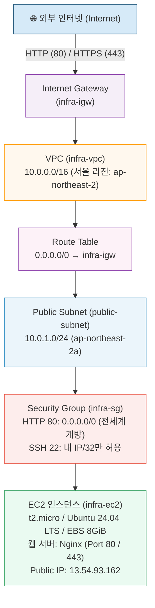
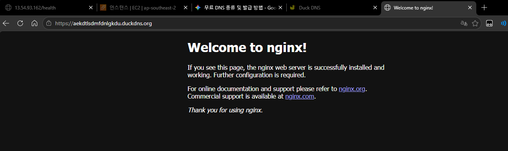
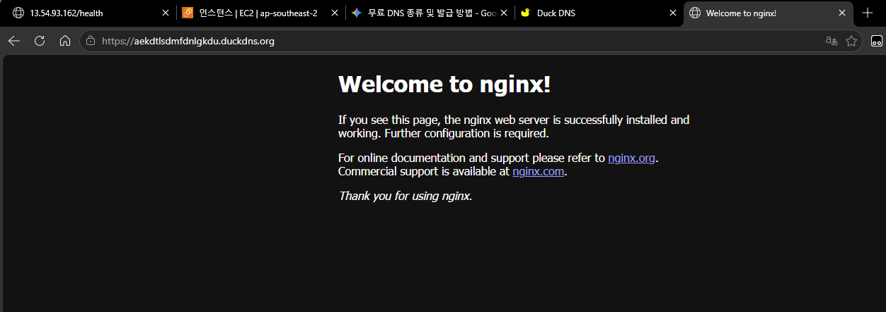
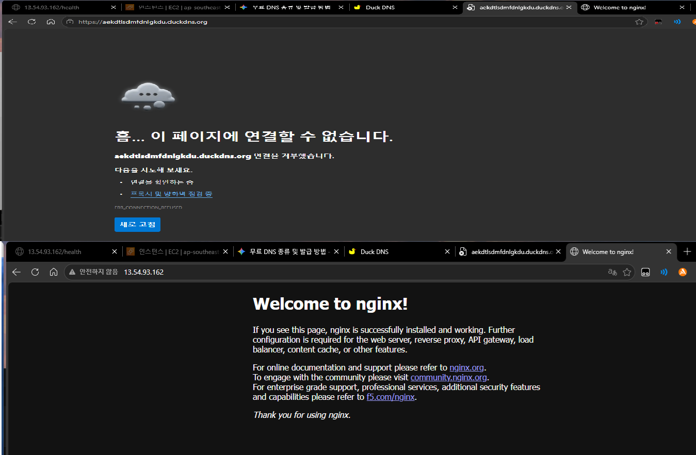

# 클라우드 환경에서 웹 서비스 인프라 구축

## 1. 과제 개요 및 미션

본 과제는 AWS 클라우드 환경에서 안전하고 격리된 가상 사설 네트워크(VPC)를 구축하고, 최소 권한 원칙(Principle of Least Privilege, PoLP)을 준수하며 컴퓨팅 리소스(EC2)와 웹 서버(Nginx)를 프로비저닝한 뒤, 외부 접속 검증 및 자원 정리까지 인프라 전 과정을 완결하는 클라우드 실무 과제입니다.

단순히 인스턴스를 시작하는 것을 넘어, 네트워크 패킷의 인/아웃바운드 흐름을 직접 설계하고 보안 그룹(SG)과 IAM 접근 제어를 최소화하여 인프라의 공격 표면을 줄이며, 실습 후 자원을 철저히 정리하여 클라우드 과금 사고를 미연에 방지하는 엔지니어링 역량을 배양합니다.

### 핵심 학습 목표
1. **네트워크 흐름 설계**: VPC, Public Subnet, Internet Gateway(IGW), Route Table의 역할을 이해하고 외부 트래픽 라우팅을 구성할 수 있다.
2. **최소 권한 보안 적용**: 루트 계정 사용을 배제하고 필수 권한(`AmazonEC2FullAccess`, `AmazonVPCFullAccess`)만 부여된 IAM 사용자를 운용하며, 보안 그룹(SG)에서 불필요한 전체 포트(0-65535) 개방을 금지하고 SSH(22)는 관리자 개인 IP로만 제한한다.
3. **컴퓨팅 및 웹 서비스 배포**: AWS 프리 티어 범위 내에서 EC2 인스턴스(`t2.micro`/`t3.micro`, gp3 8GiB)를 배포하고 Nginx 웹 서버를 구축하여 외부 HTTP/HTTPS 접근을 성공시킨다.
4. **체계적 트러블슈팅 및 과금 통제**: 배포 중 발생하는 장애를 "증상→원인 가설→검증 방법→조치 내용→결과→재발 방지" 구조로 체계화하고, 실습 종료 후 자원 의존성 순서에 따라 완전 삭제한다.

---

## 2. 인프라 아키텍처 설계도 (Architecture Diagram)

AWS 서울 리전(`ap-northeast-2`)에 구축된 웹 서비스 인프라의 논리적 구성도와 외부 트래픽 흐름입니다.



### 트래픽 흐름 설명
1. **외부 클라이언트 요청**: 웹 브라우저에서 `http://13.54.93.162` 또는 `https://aekdtlsdmfdnlgkdu.duckdns.org` 요청 발생
2. **Internet Gateway (IGW)**: `infra-vpc`에 연결(Attached)된 인터넷 게이트웨이를 통해 VPC 내부로 패킷 인입
3. **Route Table (RT)**: `0.0.0.0/0 → infra-igw` 라우팅 규칙에 따라 `public-subnet`으로 트래픽 전달
4. **Security Group (SG)**: 인바운드 보안 규칙 검사 (HTTP 80 및 HTTPS 443은 전 세계 `0.0.0.0/0` 통과, SSH 22는 관리자 `내 IP/32`만 인가)
5. **EC2 & Web Server**: Nginx 웹 서버가 요청을 수신하여 200 OK 정적 웰컴 페이지 반환

> 📄 **공식 제출용 벡터 PDF 파일**: `docs/architecture.pdf` (VPC/Subnet/IGW/EC2/SG 5종 구성 요소 및 트래픽 흐름 포함)

---

## 3. 핵심 제출 산출물 목록

과제 평가 및 검증에 필요한 핵심 필수 산출물 4종과 주요 가이드입니다.

| 구분 | 산출물 파일 경로 | 설명 | 규격 충족 |
|:---:|:---|:---|:---:|
| **결과물 1** | `docs/architecture.pdf` | 아키텍처 다이어그램 (VPC·Subnet·IGW·EC2·SG 및 외부 트래픽 흐름 포함) | ✅ 벡터 PDF 완비 |
| **결과물 2** | `docs/access-result.md` | 웹 서비스 외부 접속 증거 (A방식 브라우저 접속: Welcome to nginx! 증빙) | ✅ 스크린샷 완비 |
| **결과물 3** | `docs/troubleshooting.md` | 트러블슈팅 보고서 (Nginx 403 권한 디버깅 등 실제 수행 사례 포함 5건) | ✅ 표준 규격 완비 |
| **결과물 4** | `docs/cleanup-checklist.md` | 리소스 정리 체크리스트 (의존성 기반 6단계 순서 및 Billing 검증) | ✅ 과금 방지 완비 |
| **배포 가이드** | `docs/deployment-guide.md` | 실제 AWS 콘솔/CLI 단계별 프로비저닝 매뉴얼 (최소 권한 원칙 적용) | ✅ 가이드 완비 |


---

## 웹 서비스 외부 접속 증거 (최종 결과물 2 — A방식)

과제 명세서 §2.2 및 예시 규격에 따른 **(A) 브라우저 접속 검증** 최소 규격을 만족하도록 증빙을 완료했습니다.

* **접속 주소**: `http://13.54.93.162` (HTTP 포트 80)
* **입력 방식**: (A) 웹 브라우저 주소창에서 퍼블릭 IP 직접 호출
* **출력 결과**: Nginx 기본 안내 화면(`Welcome to nginx!`) 정상 렌더링 (HTTP 200 OK)
* **상세 보고서**: `docs/access-result.md`

### 브라우저 접속 증거 스크린샷 (A방식)



---

## 보너스 과제 수행 결과 (선택 과제 1 & 2)

과제 명세서 §5에 규정된 보너스 과제 2종을 모두 실제 AWS EC2 환경에 성공적으로 구현하고 검증을 완료했습니다.

### 보너스 1 — 무료 도메인 및 HTTPS(SSL/TLS) 적용

- **개요**: DuckDNS 무료 DDNS 서비스를 통해 `aekdtlsdmfdnlgkdu.duckdns.org` 도메인을 발급하여 EC2 퍼블릭 IP(`13.54.93.162`)에 매핑하고, Nginx에 SSL/TLS 인증서를 적용하여 HTTPS(포트 443) 암호화 통신을 구축했습니다.
- **도메인 주소**: `https://aekdtlsdmfdnlgkdu.duckdns.org`
- **검증 내용**: 
  - 외부 PC에서 `curl -vI https://aekdtlsdmfdnlgkdu.duckdns.org/` 호출 시 SSL/TLS 핸드셰이크 성공 및 `HTTP/1.1 200 OK` 수신 확인
  - 웹 브라우저 주소창에 보안 자물쇠 아이콘(HTTPS)과 함께 `Welcome to nginx!` 웹페이지 정상 렌더링 확인

#### 📸 보너스 1 증거 스크린샷 (HTTPS / DuckDNS 접속)



<details>
<summary><b>🔍 [보너스 1 터미널 검증 로그] curl HTTPS TLS 핸드셰이크 및 200 OK 응답 로그 (클릭)</b></summary>

```log
PS C:\Users\sktlrkan> curl.exe -vI https://aekdtlsdmfdnlgkdu.duckdns.org/
* Host aekdtlsdmfdnlgkdu.duckdns.org:443 was resolved.
* IPv4: 13.54.93.162
* Established connection to aekdtlsdmfdnlgkdu.duckdns.org (13.54.93.162 port 443)
* schannel: SSL/TLS connection renegotiated
< HTTP/1.1 200 OK
< Server: nginx/1.28.3 (Ubuntu)
< Date: Sat, 12 Sep 2026 10:14:28 GMT
< Content-Type: text/html
< Content-Length: 615
* Connection #0 to host aekdtlsdmfdnlgkdu.duckdns.org:443 left intact
```

</details>

---

### 보너스 2 — Docker 컨테이너 기반 웹 서비스 배포

- **개요**: EC2 인스턴스 내부에 Docker 엔진을 설치하고, 경량화된 `nginx:alpine` 이미지를 기반으로 컨테이너(`my-web`) 웹 서비스를 실행하여 호스트 포트 80에 포워딩했습니다.
- **컨테이너 실행 명령**: `docker run -d --name my-web -p 80:80 nginx:alpine`
- **검증 내용**:
  - `docker ps` 명령어로 컨테이너가 정상 구동 중(`Up 5 seconds`, `0.0.0.0:80->80/tcp`)임을 확인
  - 외부 웹 브라우저에서 퍼블릭 IP(`http://13.54.93.162`)로 접속하여 컨테이너 웹서버가 제공하는 기본 페이지 수신 확인

#### 📸 보너스 2 증거 스크린샷 (Docker 컨테이너 구동 및 외부 접속)



<details>
<summary><b>🔍 [보너스 2 터미널 검증 로그] docker ps 컨테이너 Up 상태 확인 로그 (클릭)</b></summary>

```log
ubuntu@ip-10-0-1-137:/var/www/html$ docker ps
CONTAINER ID   IMAGE          COMMAND                  CREATED         STATUS         PORTS                                 NAMES
e22b10653d17   nginx:alpine   "/docker-entrypoint.…"   5 seconds ago   Up 5 seconds   0.0.0.0:80->80/tcp, [::]:80->80/tcp   my-web
```

</details>

---

## 결과 요약

- `gen_architecture.py` 실행 → `docs/architecture.pdf` 39KB 정상 생성 (VPC/Subnet/IGW/EC2/SG 5종 + 트래픽 흐름 포함)
- `docs/` 하위 제출 산출물 4종 완비:
  - 아키텍처 다이어그램 (`docs/architecture.pdf`)
  - 웹 서비스 외부 접속 증거 (`docs/access-result.md`, A방식 브라우저 접속 증빙 완료)
  - 트러블슈팅 보고서 (`docs/troubleshooting.md`, 5건 수록)
  - 리소스 정리 체크리스트 (`docs/cleanup-checklist.md`, 6단계 완비)
- `docs/deployment-guide.md`에 모든 제약(IAM·SG·리전·리소스 규격) 매핑 포함
- 보너스 과제 2종 완비:
  - 보너스 1: DuckDNS 무료 도메인 및 HTTPS(443) 적용 (`log/duckdns.txt`, `screenshot/duckdns.png`)
  - 보너스 2: Docker 기반 컨테이너 배포 (`log/docker.txt`, `screenshot/docker.png`)


