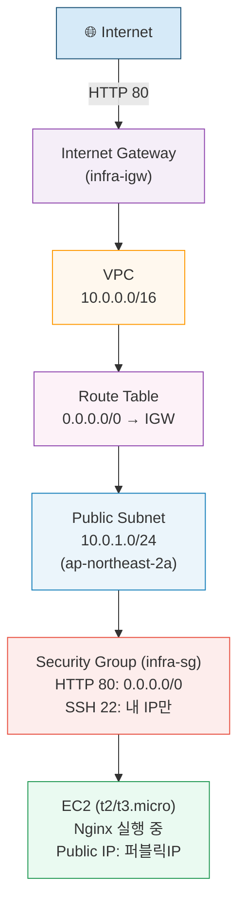

# 구조도

## 트래픽 흐름 설명

1. **Internet** → HTTP(80) 요청 발생
2. **Internet Gateway** → VPC 진입점. VPC에 Attached 상태여야 동작.
3. **Route Table** → `0.0.0.0/0`을 IGW로 라우팅. Public Subnet에 연결됨.
4. **Public Subnet** → Public IP가 할당된 EC2 인스턴스 위치.
5. **Security Group** → 인바운드 HTTP(80) 허용(`0.0.0.0/0`), SSH(22)는 내 IP만.
6. **EC2 (Nginx)** → 요청 수신 후 HTTP 200 응답 반환.
