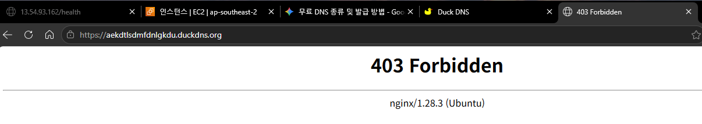

# 트러블슈팅 보고서

> 실습 중 발생한 문제를 **증상 → 원인 가설 → 검증 방법 → 조치 내용 → 결과 → 재발 방지** 구조로 기록한다.
> 본 보고서에는 총 5건의 시나리오가 수록되어 있으며, **#1~#4는 인프라 설계 및 사전 예방 목적의 가상 시나리오**, **#5는 실제 AWS 배포 환경에서 직접 겪고 해결한 실제 장애 디버깅 사례**입니다.

---

## 📋 트러블슈팅 시나리오 목록 및 수행 여부

| 번호 | 유형 | 트러블슈팅 제목 | 수행 구분 | 증적 자료 |
|:---:|:---:|:---|:---:|:---:|
| **#1** | 네트워크/보안 | 인스턴스 생성 후 SSH 접속 불가 | 가상 시나리오 (사전 예방) | 가이드 및 체크리스트 |
| **#2** | 네트워크/라우팅 | 외부에서 http://퍼블릭IP 접속 불가 (Nginx 실행 후) | 가상 시나리오 (사전 예방) | 가이드 및 체크리스트 |
| **#3** | IAM/권한 | IAM 사용자로 콘솔 접속 후 VPC 생성 권한 오류 | 가상 시나리오 (사전 예방) | IAM 정책 정의 |
| **#4** | 웹 데몬/소켓 | Nginx 소켓 바인딩(NIC Interface Binding) 불일치 거부 | 가상 시나리오 (사전 예방) | 설정 파일 템플릿 |
| **#5** | **POSIX 권한/웹** | **Nginx 403 Forbidden 직면 시 다각적 원인 가설 수립 및 POSIX 권한 소거 디버깅** | **★ 실제 수행 사례 (Real-world)** | **실제 터미널 로그 + 스크린샷 2종** |

---

## 트러블슈팅 #1. [가상 시나리오] 인스턴스 생성 후 SSH 접속 불가

| 항목 | 내용 |
|------|------|
| 증상 (문제 상황) | EC2 인스턴스 시작 후 `ssh -i infra-keypair.pem ubuntu@<퍼블릭IP>` 실행 시 타임아웃 발생. 응답 없이 연결 실패. |
| 원인 가설 | 보안 그룹 인바운드 22번 포트가 내 IP로 제한되지 않았거나, 소스를 `0.0.0.0/0`으로 실수 설정했을 가능성. 또는 퍼블릭 IP 미할당. |
| 검증 방법 | 1. EC2 콘솔 → 인스턴스 선택 → **보안** 탭 → 인바운드 규칙 확인 (22포트 소스 확인). 2. 퍼블릭 IP 할당 여부 확인. 3. `curl -v telnet://<퍼블릭IP>:22` 또는 포트 스캔으로 22 포트 응답 확인. |
| 조치 내용 | 보안 그룹 인바운드 규칙에서 SSH(22) 소스를 `내IP/32`(예: `218.x.x.x/32`)로 수정. 퍼블릭 IP 자동 할당이 비활성화된 경우 서브넷 설정에서 활성화. |
| 결과 | SSH 접속 성공. `ubuntu@ip-10-0-1-x`  프롬프트 표시. |
| 재발 방지 | 배포 전 체크리스트에 "SSH 소스 제한(내 IP/32)" 항목 추가. 서브넷 생성 시 "퍼블릭 IP 자동 할당" 즉시 활성화. |

---

## 트러블슈팅 #2. [가상 시나리오] 외부에서 http://퍼블릭IP 접속 불가 (Nginx 실행 후)

| 항목 | 내용 |
|------|------|
| 증상 (문제 상황) | Nginx 설치 후 `curl http://localhost`는 200 OK이나, 외부 PC에서 `http://<퍼블릭IP>` 접속 시 타임아웃. |
| 원인 가설 | 보안 그룹 인바운드에 HTTP(80) 허용 규칙 누락. 또는 Route Table에 IGW 경로 미설정. |
| 검증 방법 | 1. 보안 그룹 인바운드 규칙에 HTTP(80) `0.0.0.0/0` 존재 여부 확인. 2. Route Table → 라우팅 탭에서 `0.0.0.0/0 → igw-xxxxx` 경로 확인. 3. Internet Gateway가 VPC에 연결(Attached) 상태인지 확인. |
| 조치 내용 | 보안 그룹에 HTTP(80) `0.0.0.0/0` 인바운드 규칙 추가. Route Table에 `0.0.0.0/0 → infra-igw` 경로 추가. |
| 결과 | 외부에서 `http://<퍼블릭IP>` 접속 성공. Nginx 기본 페이지("Welcome to nginx!") 표시. |
| 재발 방지 | VPC 구성 완료 시점에 Route Table 경로와 IGW 연결 상태를 배포 전 체크리스트로 확인. |

---

## 트러블슈팅 #3. [가상 시나리오] IAM 사용자로 콘솔 접속 후 VPC 생성 권한 오류

| 항목 | 내용 |
|------|------|
| 증상 (문제 상황) | IAM 사용자 로그인 후 VPC 생성 시 "권한이 없습니다(AccessDenied)" 오류 발생. |
| 원인 가설 | IAM 정책에 `AmazonVPCFullAccess`가 연결되지 않고 `AmazonEC2FullAccess`만 연결된 상태. |
| 검증 방법 | IAM 콘솔 → 사용자 → 권한 탭 → 연결된 정책 목록 확인. `AmazonVPCFullAccess` 누락 여부 확인. |
| 조치 내용 | IAM 사용자에 `AmazonVPCFullAccess` 정책 추가 연결. |
| 결과 | VPC, Subnet, IGW, Route Table 생성 정상 동작. |
| 재발 방지 | 실습 시작 전 IAM 사용자 권한 목록을 체크리스트로 확인. EC2+VPC 권한 동시 설정 가이드 문서화. |

---

## 트러블슈팅 #4. [가상 시나리오] Nginx 소켓 바인딩(NIC Interface Binding) 불일치로 인한 외부 접속 거부 (127.0.0.1:80 vs 0.0.0.0:80)

| 항목 | 내용 |
|------|------|
| **증상 (문제 상황)** | EC2 내부 루프백(`curl http://localhost`)은 200 OK이나, 외부에서 퍼블릭 IP 접속 시 즉시 `Connection refused` 발생 (보안그룹/IGW는 정상 설정). |
| **원인 가설** | Nginx `listen` 지시어가 전체 인터페이스(`0.0.0.0:80`)가 아닌 로컬 루프백(`127.0.0.1:80`)에만 바인딩되어 외부 eth0 패킷에 대해 리눅스 커널이 TCP RST 패킷을 반환함. |
| **검증 방법** | `ss -tulpn \| grep :80` 확인 결과 `127.0.0.1:80`으로 바인딩된 상태 포착, `/etc/nginx/nginx.conf` 설정 확인. |
| **조치 내용** | `listen 127.0.0.1:80;`을 `listen 80;` (`0.0.0.0:80`)으로 수정 후 `sudo nginx -t` 및 `sudo systemctl reload nginx` 실행. |
| **결과** | `0.0.0.0:80`으로 모든 NIC 소켓 바인딩 전환 완료 및 외부 브라우저 200 OK 접속 성공. |
| **재발 방지** | 데몬 구동 후 소켓 바인딩 인터페이스(`ss -tulpn`) 점검을 표준 배포 절차에 반영. |

---

## 트러블슈팅 #5. [★ 실제 수행 사례] Nginx 403 Forbidden 직면 시 다각적 원인 가설 수립 및 POSIX 권한 소거 디버깅

| 항목 | 내용 |
|------|------|
| **증상 (문제 상황)** | 로컬 PC 브라우저 및 `curl -I http://13.54.93.162` 접속 시 `HTTP/1.1 403 Forbidden` 발생. 웹페이지가 로딩되지 않고 접근 거부됨. (하단 [증상 로그] 참조) |
| **원인 가설** | **[403 5대 가설 수립]**<br>1. 인덱스 파일 부재 및 `autoindex off`<br>2. `nginx.conf` 내 `deny all` 등 명시적 접근 차단(ACL)<br>3. 업스트림(WAS/S3)의 403 에러 반환<br>4. AppArmor/SELinux 등 커널 보안 모듈 차단<br>5. POSIX 파일 권한 체계 결여 (상위 디렉터리 +x 누락 또는 파일 읽기 +r 누락) |
| **검증 방법** | **[단계별 가설 소거 및 검증 1~5]**<br>1. `sudo tail -n 20 /var/log/nginx/error.log` 점검 ➜ `open() failed (13: Permission denied)` 포착 (가설 1, 2, 3 기각, [검증 1 로그] 참조)<br>2. `ps aux \| grep nginx` 점검 ➜ 비특권 워커(`www-data`) 프로세스 실행 확인 ([검증 2 로그] 참조)<br>3. `namei -l /var/www/html/index.nginx-debian.html` 점검 ➜ 디렉터리 755 정상, index 파일 `0600(root 전용)` 권한 결여 확인 (가설 5-B 확정, [검증 3 로그] 참조)<br>4. `sudo aa-status` 및 `dmesg` 점검 ➜ 커널 보안 모듈 차단 없음 확인 (가설 4 기각, [검증 4 로그] 참조)<br>5. 권한 복구 조치(`chmod`, `chown`) 적용 및 파일 권한 재검증 ➜ 정석 권한 복구 완료 ([검증 5 및 조치 로그] 참조) |
| **조치 내용** | 최소 권한 원칙(PoLP)에 의거한 정석 권한 복구:<br>1. 디렉터리 탐색 권한: `sudo chmod 755 /var/www /var/www/html`<br>2. 정적 웹 문서 읽기 권한: `sudo chmod 644 /var/www/html/*`<br>3. 웹 서비스 전용 계정 소유권 이전: `sudo chown -R www-data:www-data /var/www/html` |
| **결과** | `curl -I http://13.54.93.162` 결과 `HTTP/1.1 200 OK` 반환 및 브라우저 기본 웹페이지 정상 로딩 성공. `/var/log/nginx/access.log`에 `200` 정상 응답 수신 확인. ([결과 확인 로그] 참조) |
| **재발 방지** | 403 Forbidden 직면 시 예단하지 않고 5대 가설 수립 및 `error.log` / `namei -l` 소거 절차 준수. 웹 배포 CI/CD 파이프라인에 표준 권한(디렉터리 755, 파일 644, 소유자 `www-data`) 자동 검증 린트 도입. |

### 📸 트러블슈팅 #5 증적 스크린샷

#### 1) 문제 발생 (403 Forbidden 접근 거부)


#### 2) 조치 후 복구 완료 (Welcome to nginx! 정상 접속)


---

### 📜 단계별 실제 증거 로그 (터미널 세션)

> 확인하고자 하는 단계의 항목을 클릭하면 해당 로그만 선별하여 열람할 수 있습니다.

<details>
<summary><b>🔍 [증상 로그] curl 요청 시 HTTP 403 Forbidden 발생 로그 (클릭)</b></summary>

```log
PS C:\Users\sktlrkan> curl.exe -I http://13.54.93.162
HTTP/1.1 403 Forbidden
Server: nginx/1.28.3 (Ubuntu)
Date: Sat, 12 Sep 2026 10:29:10 GMT
Content-Type: text/html
Content-Length: 162
Connection: keep-alive
```

</details>

<details>
<summary><b>🔍 [검증 방법 1 로그] Nginx error.log에서 Permission Denied(13) 에러 포착 로그 (클릭)</b></summary>

```log
ubuntu@ip-10-0-1-137:/var/www/html$ sudo tail -n 20 /var/log/nginx/error.log
2026/09/12 10:27:41 [error] 3563#3563: *3 open() "/var/www/html/index.nginx-debian.html" failed (13: Permission denied), client: 183.98.213.100, server: aekdtlsdmfdnlgkdu.duckdns.org, request: "GET / HTTP/1.1", host: "aekdtlsdmfdnlgkdu.duckdns.org"
2026/09/12 10:29:10 [error] 3563#3563: *5 open() "/var/www/html/index.nginx-debian.html" failed (13: Permission denied), client: 183.98.213.100, server: _, request: "HEAD / HTTP/1.1", host: "13.54.93.162"
2026/09/12 10:33:09 [error] 3562#3562: *7 open() "/var/www/html/index.nginx-debian.html" failed (13: Permission denied), client: 74.7.243.242, server: aekdtlsdmfdnlgkdu.duckdns.org, request: "GET / HTTP/1.1", host: "aekdtlsdmfdnlgkdu.duckdns.org"
2026/09/12 10:35:08 [error] 3562#3562: *8 open() "/var/www/html/index.nginx-debian.html" failed (13: Permission denied), client: 144.91.96.31, server: aekdtlsdmfdnlgkdu.duckdns.org, request: "GET / HTTP/1.1", host: "aekdtlsdmfdnlgkdu.duckdns.org"
```

</details>

<details>
<summary><b>🔍 [검증 방법 2 로그] ps aux로 Nginx 워커 프로세스 실행 계정(www-data) 확인 로그 (클릭)</b></summary>

```log
ubuntu@ip-10-0-1-137:/var/www/html$ ps aux | grep nginx
root        3561  0.0  0.2  25344  2736 ?        Ss   10:24   0:00 nginx: master process /usr/sbin/nginx -g daemon on; master_process on;
www-data    3562  0.0  1.0  27128  9980 ?        S    10:24   0:00 nginx: worker process
www-data    3563  0.0  1.0  27128  9960 ?        S    10:24   0:00 nginx: worker process
ubuntu      3603  0.0  0.2   7144  2316 pts/0    S+   10:41   0:00 grep --color=auto nginx
```

</details>

<details>
<summary><b>🔍 [검증 방법 3 로그] namei -l 경로 권한 체인 검사 및 0600(root 전용) 권한 결여 확인 로그 (클릭)</b></summary>

```log
ubuntu@ip-10-0-1-137:/var/www/html$ namei -l /var/www/html/index.nginx-debian.html
f: /var/www/html/index.nginx-debian.html
drwxr-xr-x root root /
drwxr-xr-x root root var
drwxr-xr-x root root www
drwxr-xr-x root root html
-rw------- root root index.nginx-debian.html
```

</details>

<details>
<summary><b>🔍 [검증 방법 4 로그] sudo aa-status 커널 보안 모듈(AppArmor) 차단 여부 점검 로그 (클릭)</b></summary>

```log
ubuntu@ip-10-0-1-137:/var/www/html$ sudo aa-status
apparmor module is loaded.
183 profiles are loaded.
105 profiles are in enforce mode.
...
4 processes have profiles defined.
3 processes are in enforce mode.
1 processes are in complain mode.

ubuntu@ip-10-0-1-137:/var/www/html$ dmesg | grep -i apparmor
dmesg: read kernel buffer failed: Operation not permitted
```

</details>

<details>
<summary><b>🔍 [검증 방법 5 및 조치 로그] chmod 755/644 적용, www-data 소유권 이전 및 권한 재검증 로그 (클릭)</b></summary>

```log
ubuntu@ip-10-0-1-137:/var/www/html$ sudo chmod 755 /var/www /var/www/html
ubuntu@ip-10-0-1-137:/var/www/html$ sudo chmod 644 /var/www/html/*
ubuntu@ip-10-0-1-137:/var/www/html$ sudo chown -R www-data:www-data /var/www/html
ubuntu@ip-10-0-1-137:/var/www/html$ namei -l /var/www/html/index.nginx-debian.html
f: /var/www/html/index.nginx-debian.html
drwxr-xr-x root     root     /
drwxr-xr-x root     root     var
drwxr-xr-x root     root     www
drwxr-xr-x www-data www-data html
-rw-r--r-- www-data www-data index.nginx-debian.html
```

</details>

<details>
<summary><b>🔍 [결과 확인 로그] curl HTTP 200 OK 응답 및 서버 access.log 200 수신 확인 로그 (클릭)</b></summary>

```log
PS C:\Users\sktlrkan> curl.exe -I http://13.54.93.162
HTTP/1.1 200 OK
Server: nginx/1.28.3 (Ubuntu)
Date: Sat, 12 Sep 2026 10:46:23 GMT
Content-Type: text/html
Content-Length: 615
Last-Modified: Sat, 12 Sep 2026 09:55:11 GMT
Connection: keep-alive
ETag: "6aa5217f-267"
Accept-Ranges: bytes

ubuntu@ip-10-0-1-137:/var/www/html$ sudo tail -n 5 /var/log/nginx/access.log
183.98.213.100 - - [12/Sep/2026:10:46:23 +0000] "HEAD / HTTP/1.1" 200 0 "-" "curl/8.21.0"
183.98.213.100 - - [12/Sep/2026:10:46:35 +0000] "GET / HTTP/1.1" 200 409 "-" "Mozilla/5.0 (Windows NT 10.0; Win64; x64) AppleWebKit/537.36 (KHTML, like Gecko) Chrome/153.0.0.0 Safari/537.36 Edg/153.0.0.0"
```

</details>


